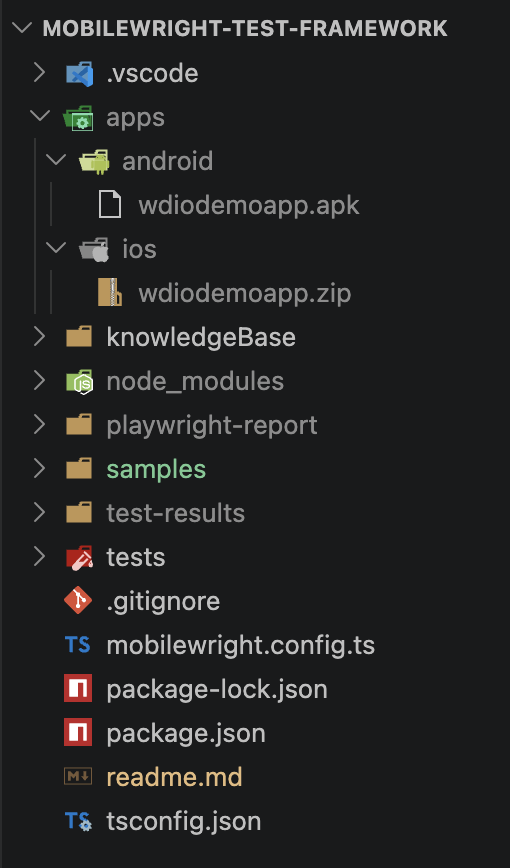

# Mobilewright Setup Guide


## Clone Repository
```
git clone https://github.com/sadabnepal/mobilewright-test-framework.git
cd mobilewright-test-framework
```

## Prerequisites

|                  | Requirement |
|------------------|-------------|
| 🟢 **Runtime**   | Node.js `>= 18` |
| 📱 **Device**    | iOS simulator, Android emulator, or connected real device |
| 🔧 **Toolchain** | Xcode (for iOS) · Android SDK + ADB (for Android) |

---

## Verify Your Environment

List connected devices:
```bash
npx mobilewright devices
```

Check environment health:
```bash
npx mobilewright doctor
```

---

## Boot a Simulator

**Step 1 : List available simulators**
```bash
xcrun simctl list devices available
```

**Step 2 : Boot a device by name or UDID**
```bash
# Replace with your device name or UDID
xcrun simctl boot "iPhone 17"
```

**Step 3 : Open Simulator app**
```bash
open -a Simulator
```

> 💡 Having trouble? Check the [KnowledgeBase](./knowledgeBase/) for setup fixes.

---

### Download and Setup app
Download both android and ios: https://github.com/webdriverio/native-demo-app/releases
1. Scroll to Assets section and download the apps
2. create folder as below
```
apps
    -> android (.apk file goes in this folder)
    -> ios (.zip file for ios goes in this folder)
```
3. Rename files as below
    - android apk file: <b> wdiodemoapp.apk </b>
    - ios zip file: <b> wdiodemoapp.zip </b>

####  Refer Folder Structure



---

## References

- [📖 **Mobilewright Getting started**](https://mobilewright.dev/docs/getting-started/writing-tests)
- [🐙 **Mobilewright Skills**](https://github.com/mobile-next/mobilewright-skill)